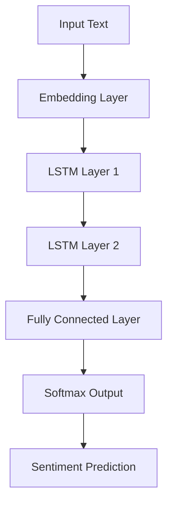

# LSTM Sentiment Analysis

**Role:** ML | **Context:** Applied Deep Learning (APS360)

## Project Overview
Developed a Deep Learning model to classify sentiment in news articles (Positive/Negative). Moved beyond baseline logistic regression by implementing a Recurrent Neural Network (RNN) with Long Short-Term Memory (LSTM) cells to capture temporal dependencies in text.

## Tech Stack
* **Framework:** PyTorch
* **Architecture:** LSTM, Word Embeddings (GloVe)
* **Tools:** Python, NumPy, Matplotlib

## Model Architecture

## Illustration of the overall pipeline
Inputs, preprocessing, 3 layer RNN, output and applications.

